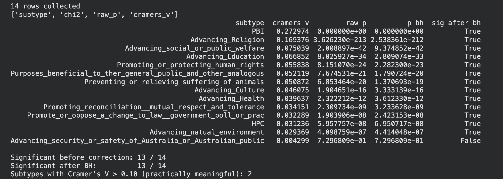
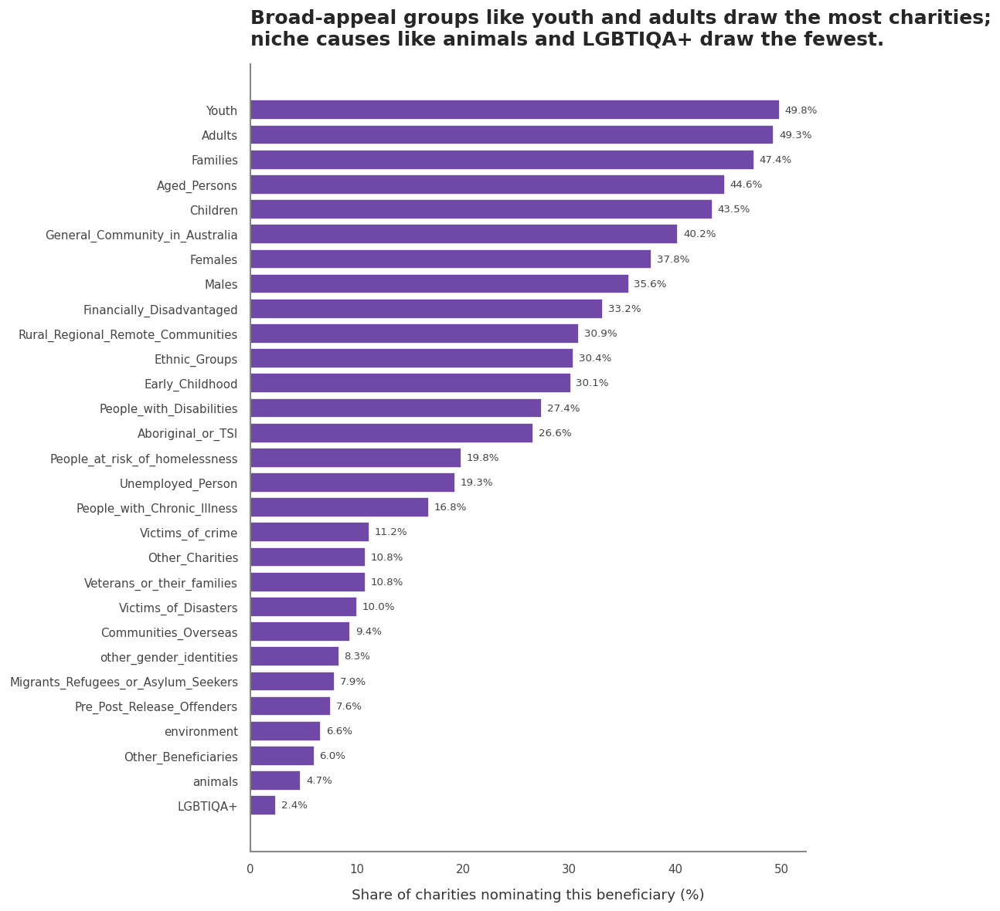

# Are Australian Charities' Purposes Related to Their Size?

A statistical analysis of ~38,000 Australian charities, testing whether a charity's *purpose* (its registered subtypes) is associated with its *size*, and being honest about the difference between a statistically significant result and a meaningful one.

## Key finding
Charitable purpose is mostly **unrelated** to organisational size. With a sample this large, almost every association is "statistically significant" — but effect sizes reveal that only two purposes are *practically* meaningful:
**Public Benevolent Institutions** skew large, 
**religious charities** skew small. 
Everything else is significant-but-negligible, a textbook case of significance without magnitude.

## Question: Is a charity's size associated with an Australian charities’ subtype? 
I conducted a statistical analysis of about ~38 000 Australian charities to see whether a charity’s purpose has any association with its size. 

Why? My assumption was that a charity’s size shapes how it operates, and how well it’s run affects the people it serves. So I wondered whether purpose (subtype) and size were linked in the first place. 

At first glance, I expected that different charity types would have different typical sizes (religious groups vs hospitals vs shelters). 

## Data
- ACNC Registered Charities dataset (~38,000 rows after filtering).
- Filtered to Australian charities operating in at least one state/territory.
- See `data/README.md` for how to obtain it.
- Key limitation: **no financial data.** "Size" is a category (Small/Medium/Large by revenue band), and there are no dollar amounts, so this analysis cannot speak to funding, reach, or impact.

## Method
- **Chi-square tests of independence** for each of 14 charity subtypes vs size (categorical vs categorical).
- **Cramér's V** as the effect-size measure — chosen because at n≈38k, p-values are near-zero everywhere and can't distinguish strong associations from trivial ones.
- **Benjamini-Hochberg correction** across the 14 tests to control false positives.
- **A permutation test** was conducted as an assumption-free cross-check on the analytic chi-square p-values (they agreed).

## Results




## Key limitations (what this analysis cannot claim)
- The takeaway that PBI charities tend to be large is simply association; this data cannot show that *being* a PBI causes a charity's size to grow.
- In the dataset, blank flags were treated as "not registered for this subtype"; some blanks may be withheld or unreported.
- There is no funding data, so "most-served beneficiary" means "nominated by the most charities," not "best supported."

## What I'd do next
Join socioeconomic data by postcode to test whether charity size relates to the affluence of that postcode in any meaningful way. 

## How to run
```
pip install -r requirements.txt
# place charities.csv in data/ (see data/README.md)
jupyter notebook notebooks/analysis.ipynb
```
